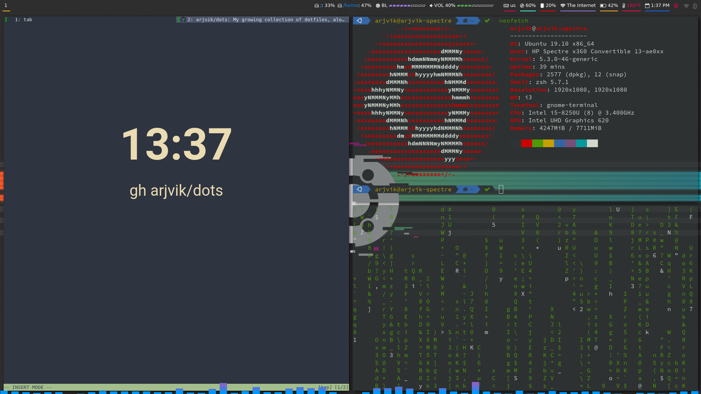

# dots
```
             _       _ _         __ _       _        
            (_)     (_) |       / /| |     | |       
   __ _ _ __ ___   ___| | __   / /_| | ___ | |_ ___  
  / _' | '__| \ \ / / | |/ /  / / _' |/ _ \| __/ __| 
 | (_| | |  | |\ V /| |   <  / / (_| | (_) | |_\__ \ 
  \__,_|_|  | | \_/ |_|_|\_\/_/ \__,_|\___/ \__|___/ 
           _/ |
          |__/

```
My growing collection of dotfiles, along with an install script.

## Installation
```shell
bash -c "$(wget https://raw.githubusercontent.com/arjvik/dots/master/install.sh -O -)"
```
If you wish to skip the long installations (i.e. `apt upgrade`, large themes, and fonts), such as on a live system, before proceeding with the installation, execute
```shell
export SKIP_LONG_INSTALLS=1
```
## Contents
- i3-gaps
- polybar
- rofi
- qutebrowser
- zsh (oh-my-zsh with powerlevel9k)

## Extras
- Argos plugins for gnome-shell (not installed by default)
- Git proxy scripts for use with NetShare (Android hotspot app)

## Screenshot

